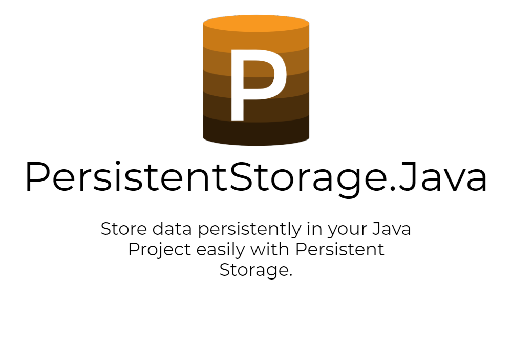

  <a href="https://github.com/jtsshieh/PersistentStorage.Java/actions?query=workflow%3A%22Build+Project%22"></img></a>
  <a href="https://github.com/jtsshieh/PersistentStorage.Java/blob/master/LICENSE"></img></a>
  

PersistentStorage.Java is a port of [PersistentStorage](https://github.com/jtsshieh/PersistentStorage) for Java. Method names are the same, except are camelCase.
